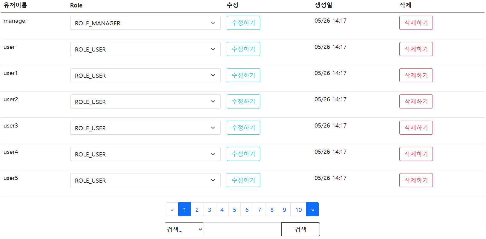
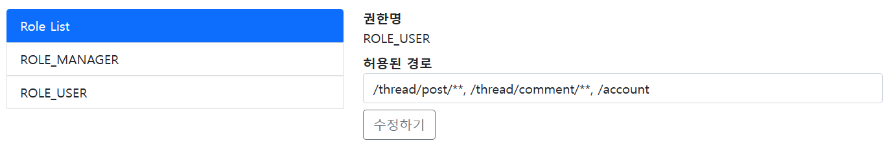
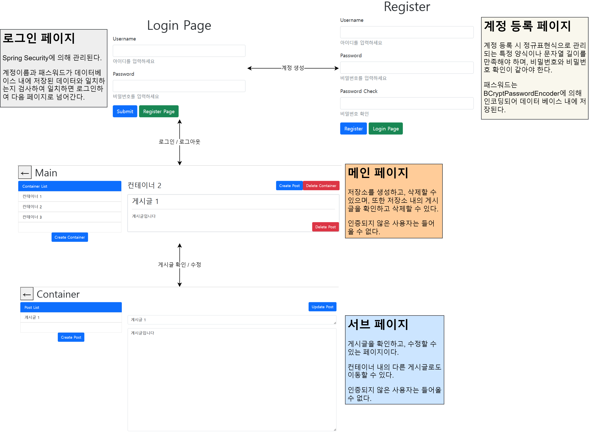
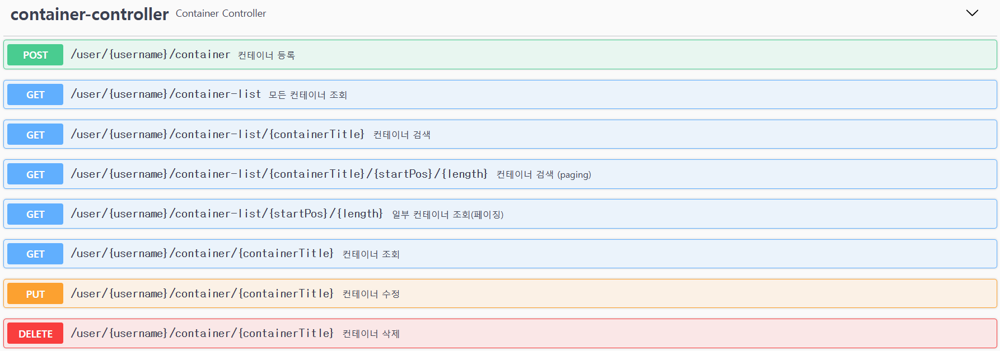
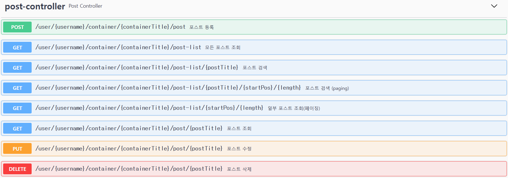
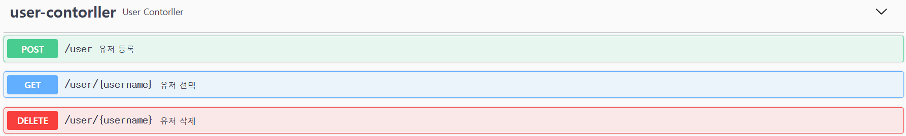
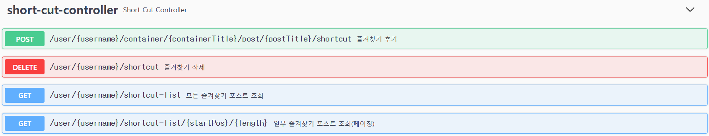

# 김병주 포트폴리오

## :pushpin: Intro
JAVA 웹 백엔드 개발자를 목표로 하고 있는 김병주 라고 합니다.   
Java Spring Framework와 Database를 기반으로 개발을 하고 있습니다.

 

## :pushpin: Contact
- 이메일: de_fer@naver.com
- 깃허브: https://github.com/faraway

 

## :pushpin: Projects

### 1. Trip Over  
>
><b>[배포 사이트 링크](https://3.36.163.190/)</b>  
>
>국내 여행을 계획하고 있는 관광객들을 위한 일정 관리 도구 제공  
>
>개발 기간: 2023.5.31 ~ 2023.7.11  
>개발 인원 : 4명  
>역할 :   
>&nbsp; 프로젝트 리더 / 개발환경 구축 / 외부 API 연결 / 지도 페이지 작성 /  
>&nbsp; 로그인 페이지 작성 / 관리자 페이지 작성 / 서버 배포
>
> ---
>
>✔ 기술 스택:  
>Backend :   
>&nbsp; Java 11 / Spring Boot v2.7.12 / MyBatis / RestTemplate /  
>&nbsp; Spring Security / Lombok / Json-simple /  Oracle DB 11g
>    
>Frontend :   
>&nbsp; JSP / JSTL / BootStrap / JavaScript / jQuery / AJAX
> 
>Server :   
>&nbsp; AWS / Ubuntu 22.04  
>
>API :  
>&nbsp; 카카오 지도 Web API / 한국관광공사 Tour API / 기상청 단기예보 API
>
>Test :  
>&nbsp; JUnit / Postman
>
>Tools :  
>&nbsp; Gradle / Git  
>
> ---
> 
>✔ 주요 구현 : 
> 
>#### 1. API를 활용한 지도 연결
>   
> 
> - Tour API의 정보를 가져와 카카오 지도 API의 기능인 마커와 인포윈도우 기능을 활용하여 위치 정보를 시각화하였다.
> - 지도 클릭과 카테고리, 지역이나 키워드 검색을 통해 사용자가 원하는 장소를 선택하기 용이하게 하였다.
> - AJAX와 Promise를 사용한 비동기 처리를 하여 사용 시 불편함을 줄이고자 하였다.  
>
> 
> - 마커를 선택하여 오른쪽 사이드 바에 장소를 쌓아올릴 수 있다.
> - 선택된 장소 사이에는 이동경로를 표시한 카카오 길찾기 페이지 탭을 띄울 수 있는 버튼을 위치시켰다.
>
> 
> - Tour API를 활용하여 특정 장소의 정보를 볼 수 있다.
> - 기상청 단기예보 API를 활용하여 그 장소의 날씨정보 또한 볼 수 있게 하였다.
>
> #### 2. Github Action을 활용한 배포 자동화
> 
> - Github Action을 활용하여 서버 배포 자동화를 진행하였다.
> - Git Ignore된 파일은 S3에서 가져와서 빌드하였다.
> - 빌드 결과물은 S3에 저장되고, Code Deploy 서비스를 활용하여 EC2 서비스로 배포된다.
> 
><b>[프로젝트 Github](https://github.com/INGPlay/MultiBackendTeam3)</b> 참고

---

### 2. DynamicAuthority
>실시간으로 권한을 변경할 수 있는 게시판 웹 애플리케이션 구현  
>개발 기간: 2023.5.13 ~ 2023.5.31  
>개발 인원 : 1명
> 
> ---
> 
>✔ 기술 스택:  
>Backend :   
>&nbsp; Java 11 / Spring Boot v2.7.11 / QueryDsl / Spring Data Jpa /  
>&nbsp; Spring Security / Lombok / H2 DB /  
>  
>Frontend :   
>&nbsp; HTML / Thymleaf / BootStrap / JavaScript / jQuery / AJAX / 
>  
>Tools :  
>&nbsp; Gradle / Git  
>
> ---
> 
>✔ 주요 구현 :
> 
> #### - Spring Security를 활용한 실시간 권한 제어
> 
> - 관리자가 사용자의 권한을 즉각적으로 수정하거나 사용자의 계정을 삭제할 수 있도록 하였다.
> - 권한이 수정되면 수정된 사용자는 로그아웃 하게 된다. (SessionRegistry를 활용함)
> 
> 
> - 특정 Role에게 허용된 경로 또한 지정해 줄 수 있다.
> 
><b>[프로젝트 Github](https://github.com/INGPlay/SpringBoardAuthority)</b> 참고

---

### 3. Notebook
>사용자 계정마다 독립된 환경에서 노트를 저장할 수 있는 웹 애플리케이션 (개인 프로젝트)  
>개발 기간: 2023.3.31 ~ 2023.4.10  
>개발 인원 : 1명
>  
> ---
> 
>✔ 기술 스택:  
>Backend :   
>&nbsp; Java 11 / Spring Boot v2.7.10 / MyBatis / Spring Security / Oracle DB
>
>Frontend :   
>&nbsp; HTML / Thymleaf / BootStrap 
>
>Tools :  
>&nbsp; Gradle / Git
>  
> ---
> 
>✔ 주요 구현 :
> 
> #### - 스프링 시큐리티와 연계한 페이지 작성 
> 
> - 로그인과 가입페이지에서 Spring Validation을 활용한 문자열 검증을 실시하였다.
> - Spring Security를 활용하여 로그인한 각 개인만 접근할 수 있는 페이지를 작성하였다.
> 
><b>[프로젝트 Github](https://github.com/INGPlay/SpringMVC_Practice)</b> 참고

---

### 4. Notebook API
>Notebook 프로젝트를 API 작성 및 개선한 프로젝트 (개인 프로젝트)  
>개발 기간: 2023.4.20 ~ 2023.4.30
>개발 인원: 1명 
>  
> ---
> 
>✔ 기술 스택:  
>Backend :   
>&nbsp; Java 11 / Spring Boot v2.7.10 / Hibernate JPA / H2 DB 
>  
>Test :  
>&nbsp; Swagger UI / Postman 
>
>Tools :  
>&nbsp; Gradle / Git
> 
> ---
> 
>✔ 주요 구현 :
>
> #### - 게시판 Rest API 작성 및 Swagger UI 활용
> 
> 
> 
> 
> 
> -  작성한 게시판 API를 Swagger UI로 활용할 수 있도록 하였다.
> 
><b>[프로젝트 Github](https://github.com/INGPlay/Spring_API_JPA_example)</b> 참고

---

### etc. Kopanda
>외국인 한국어 학습자를 위한 발화 평가 및 피드백 서비스  (팀 프로젝트)  
>개발 기간: 2022.10 ~ 2022.12
>개발 인원: 5명
>  
>✔ 기술 스택:  
>Python 3 / Flask / Tensorflow / KoElectra / KoGPT /  
>MySQL / Pandas / Numpy / HTML / BootStrap / etc...
>  
><b>[프로젝트 소개 및 역할](https://docs.google.com/presentation/d/1pBwJjTmGPJO357GKYYWPZApCdTJhJGyzAf1A71sZ0D0/edit?usp=sharing)</b> 참고

---

