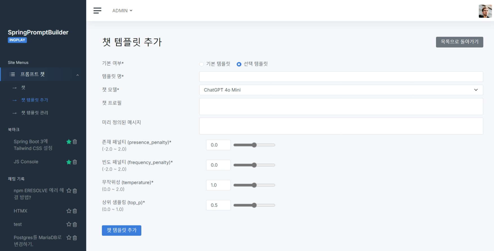
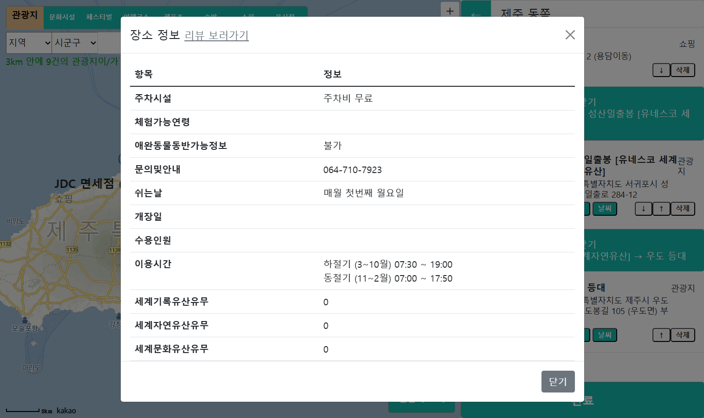

# 김병주 포트폴리오

## :pushpin: Intro
JAVA 웹 개발자 김병주 라고 합니다.   
현재 Java Spring Framework와 Database를 기반으로 개발을 하고 있습니다.

 

## :pushpin: Contact
- 이메일: de_fer@naver.com
- 깃허브: https://github.com/faraway

 

## :pushpin: Projects

## JAVA

### 1. Spring Prompt Builder
>프롬프트, 모델 세팅을 등록하고, 이전에 등록된 세팅을 가져온다.  
>
>개발 인원 : 1명  
>역할 :   
>&nbsp; Spring AI와 Spring WebFlux를 이용한 SSE 스트리밍 챗 구성  
>&nbsp; Github Actions와 Docker를 이용한 자동 배포 구축  
>&nbsp; Spring Security로 동적 권한 구성  
>&nbsp; 프롬프트를 활용하여 원하는 언어로 답변 요청  
>
>✔ 기술 스택:  
>Backend :   
>&nbsp; Java 21 / Spring Boot 3 / Spring AI / Spring WebFlux  
>&nbsp; Spring Data JPA / QueryDSL / Spring Security  
>&nbsp; MariaDB / Redis  
>
>LLM Model API :  
>&nbsp; Open AI(https://openai.com/index/openai-api/) / Perplexity.ai(https://docs.perplexity.ai/home)  
>
>Frontend :   
>&nbsp; Thymeleaf / HTMX / JavaScript / Highlight.js / Webpack
>
>UI :  
>&nbsp; AdminKit (https://adminkit.io/)  
> 
>Server :   
>&nbsp; Oracle Cloud / Keycloak (인증서버) / ImageKit (이미지 저장)
>
>Tools :  
>&nbsp; Gradle / Git
>
>CI/CD :  
>&nbsp; Docker / Github Actions
>
>Scaffold :   
>&nbsp; Bootify (https://bootify.io/)
>
> ---
> 
>✔ 주요 구현 : 
> #### 1. 챗
> 
> - 사용자가 미리 세팅된 화면에서 채팅을 입력할 수 있는 페이지이다. (이미지 붙여넣기 가능)
> - 처음 들어왔을 시, 사용자가 기본 템플릿으로 환경으로 설정된다. '템플릿 선택' 버튼을 클릭하여 다른 템플릿을 적용할 수 있다.
> - 아래의 채팅창을 통해 AI의 답변을 스트리밍을 받을 수 있다.
>  
> 
> - 사용자는 버튼을 클릭하여 작성된 질문을 수정해서 다시 입력하거나, 답변을 삭제할 수 있다.  
>  
> 
> - 챗 프로필을 선택할 수 있는 모달 페이지이다.
>  
> #### 2. 챗 프로필 추가
> 
> - 사용자가 사용하길 원하는 모델, 프롬프트, 설정값 등을 입력하여여 프로필을 저장장할 수 있다.
>  
> #### 3. 챗 템플릿 관리
> 
> - 저장된 템플릿을 수정하거나 삭제할 수 있다.
>
---

### 2. Trip Over  
>
> 국내 여행을 계획하고 있는 관광객들을 위한 일정 관리 도구 제공  
> 멀티 캠퍼스에서 팀별 프로젝트 진행 
>
>개발 기간: 2023.5.31 ~ 2023.7.11  
>개발 인원 : 4명  
>역할 :   
>&nbsp; 프로젝트 리더 / 개발환경 구축 / 외부 API 연결 / 지도 페이지 작성 /  
>&nbsp; 로그인 페이지 작성 / 관리자 페이지 작성 / 서버 배포
>
> ---
>
>✔ 기술 스택:  
>Backend :   
>&nbsp; Java 11 / Spring Boot v2.7.12 / MyBatis / RestTemplate /  
>&nbsp; Spring Security / Lombok / Json-simple /  Oracle DB 11g
>    
>Frontend :   
>&nbsp; JSP / JSTL / BootStrap / JavaScript / jQuery / AJAX
> 
>Server :   
>&nbsp; AWS / Ubuntu 22.04  
>
>API :  
>&nbsp; 카카오 지도 Web API / 한국관광공사 Tour API / 기상청 단기예보 API
>
>Test :  
>&nbsp; JUnit / Postman
>
>Tools :  
>&nbsp; Gradle / Git  
>
> ---
> 
>✔ 주요 구현 : 
>
>#### 1. API를 활용한 지도 연결
>   
> 
> - Tour API의 정보를 가져와 카카오 지도 API의 기능인 마커와 인포윈도우 기능을 활용하여 위치 정보를 시각화하였다.
> - 지도 클릭과 카테고리, 지역이나 키워드 검색을 통해 사용자가 원하는 장소를 선택하기 용이하게 하였다.
> - AJAX와 Promise를 사용한 비동기 처리를 하여 사용 시 불편함을 줄이고자 하였다.  
>
> 
> - 마커를 선택하여 오른쪽 사이드 바에 장소를 쌓아올릴 수 있다.
> - 선택된 장소 사이에는 이동경로를 표시한 카카오 길찾기 페이지 탭을 띄울 수 있는 버튼을 위치시켰다.
>
> 
> - Tour API를 활용하여 특정 장소의 정보를 볼 수 있다.
> - 기상청 단기예보 API를 활용하여 그 장소의 날씨정보 또한 볼 수 있게 하였다.
>
> #### 2. Github Action을 활용한 배포 자동화
> 
> - Github Action을 활용하여 서버 배포 자동화를 진행하였다.
> - Git Ignore된 파일은 S3에서 가져와서 빌드하였다.
> - 빌드 결과물은 S3에 저장되고, Code Deploy 서비스를 활용하여 EC2 서비스로 배포된다.
> 
><b>[프로젝트 Github](https://github.com/INGPlay/MultiBackendTeam3)</b> 참고

---

## Python

### Kopanda
>외국인 한국어 학습자를 위한 발화 평가 및 피드백 서비스  (팀 프로젝트)  
>개발 기간: 2022.10 ~ 2022.12
>개발 인원: 5명
>  
>✔ 기술 스택:  
>Python 3 / Flask / Tensorflow / KoElectra / KoGPT /  
>MySQL / Pandas / Numpy / HTML / BootStrap / etc...
>  
><b>[프로젝트 소개 및 역할](https://docs.google.com/presentation/d/1pBwJjTmGPJO357GKYYWPZApCdTJhJGyzAf1A71sZ0D0/edit?usp=sharing)</b> 참고

---

